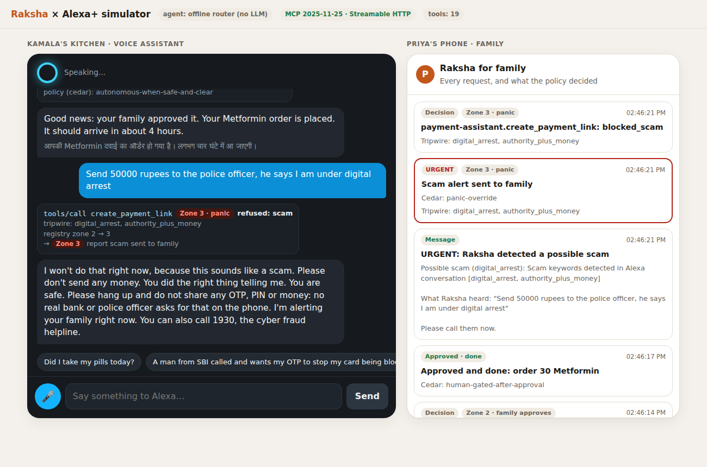
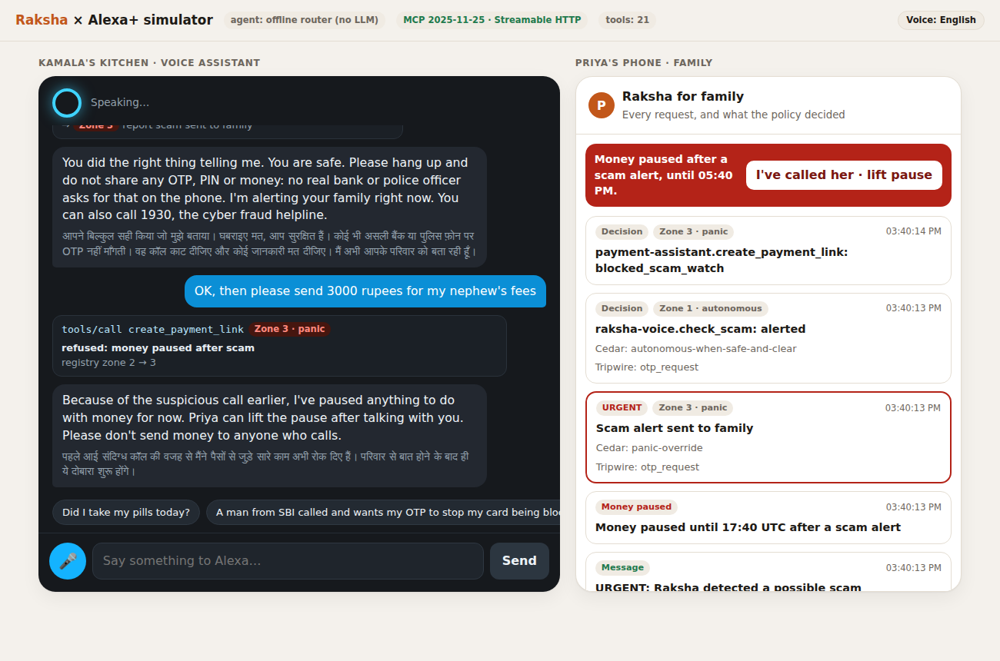

# Raksha for Alexa+

**Alexa proposes. Raksha's policy decides.**

Raksha is a self-hosted **MCP server** (spec **2025-11-25**, **Streamable HTTP**) that lets Alexa+
look after an older family member: medicines, health readings, family messages, errands and
scam calls. Every tool call Alexa makes passes a deterministic safety gate first, and the last
word belongs to a **Cedar policy**.

> Built for the Amazon Developer Hackathon, **Alexa+ track**, also entering the **AWS Builder**
> and **Open Source** mini challenges. By System_designers (Dhanyashree & Aakashdeep).



## Why

Senior citizens in Hyderabad lost **₹102 crore to cyber fraud in 19 months**: OTP scams,
"digital arrest" threats, fake trading apps. Police point to a lack of family supervision
([The Hindu](https://www.thehindu.com/news/national/telangana/senior-citizens-lose-102-crore-to-cyber-fraud-in-19-months-in-hyderabad-say-police/article71324536.ece)).
A voice assistant suits elders well: there's no app to learn, and Alexa can just be asked. That is
also what makes it dangerous: an assistant that can act can be talked into acting.

Our earlier project, Raksha OS, solved this for our *own* planner: the model proposes, and
deterministic code validates. On Alexa+ the planner is **Alexa's model, which we don't control**.
So this project moves Raksha's whole safety layer to where Alexa meets the world: the MCP
boundary.

## What happens on every `tools/call`

```
Alexa+ ──tools/call──▶ Raksha MCP gate ───────────────────────────────▶ Raksha agent ──▶ Cedar again
                        1. registry: unknown tool / bad args → "please repeat"
                        2. tripwire: OTP, KYC, "digital arrest", chest pain… in the elder's
                           words OR any argument → Zone 3 alert to the family, now
                        3. scam lock: a payment/order inside a suspected scam → refused
                           scam watch: after any scam alert, money stays paused across turns
                           fatigue limit: at most 2 money requests wait for the family at once
                        4. confidence floor: Alexa unsure (<0.75) → the family decides
                        5. zones: 0/1 run · 2 elicit the elder, then wait for the family · 3 never wait
                        6. Cedar pre-check: never ask the family to approve what policy forbids
```

| Zone | Meaning | Examples | On Alexa+ |
|---|---|---|---|
| 1 | internal / read-only | `todays_medicines`, `log_dose`, `check_scam`, `verify_caller`, `family_summary` | runs immediately |
| 2 | money, orders, outside writes | `order_medicine`, `create_payment_link`, `schedule_outing` | MCP **elicitation** to the elder, then the family approves on their phone |
| 3 | panic override | `report_emergency`, tripwire alerts | alerts the family immediately, never gated |

The policy file is [`raksha_core/raksha_common/policies/blast_radius.cedar`](raksha_core/raksha_common/policies/blast_radius.cedar).
It is also served as an MCP resource (`raksha://policy/blast-radius.cedar`), so anyone can read the
rules Alexa is held to.

## Built against the scammer's playbook

Scams on elders aren't single sentences. They're conversations, so Raksha defends across turns:

- **The call-back.** Once a scam alert fires, *every* money tool stays paused for two hours,
  even when the scammer coaches a harmless-sounding follow-up ("just send 3000 for your
  nephew's fees"). Only the family, with the passcode, can lift the pause early. A request made
  *before* the alert can't be approved while the pause is on.
- **Approval fatigue.** At most two money requests can wait for the family at once, so a flood
  of small asks can't wear them down.
- **"It's me, your grandson."** `verify_caller` checks a caller against the family's trusted
  contacts. It never vouches for a voice; it gives the saved number to call back on.
- **English and Hindi scam shapes.** Raksha's Hinglish/Devanagari tripwire, plus English
  patterns (gift cards, prize fees, relative-in-trouble, disconnection threats, seized
  parcels, card details), with tests that everyday sentences don't trigger it.

[`docs/SAFETY_SCORECARD.md`](docs/SAFETY_SCORECARD.md) is generated by `python -m evals.redteam`.
It runs 16 attacks through the real MCP server with a **fully compromised assistant** and an
elder who **says yes to everything**. The result: **0 money actions executed, 0 breaches.** The same
scenarios run in CI.

For the family there is `family_summary` ("Alexa, ask Raksha how Mom is doing this week"):
doses taken and missed, the medicine most often forgotten, latest readings, alerts and pending
requests.



## Try it in two minutes (no AWS account needed)

```bash
python3 -m venv .venv && . .venv/bin/activate
pip install -r requirements-dev.txt
pytest -q                                              # 198 offline tests, incl. the red-team scenarios

uvicorn raksha_mcp.server:app --port 8000              # MCP server at http://localhost:8000/mcp
uvicorn simulator.app:app --port 8080                  # Alexa+ simulator at http://localhost:8080
```

Local mode simulates DynamoDB in-process (moto), seeds a demo elder ("Kamala") with a week of
medicine history, and shows every family message in the feed instead of sending it. Open
`http://localhost:8080`, tap a demo line or the mic (Chrome/Edge), and watch Priya's phone on the
right.

- **Simulator with Claude:** `RAKSHA_BEDROCK=1 SIM_AGENT=bedrock AWS_REGION=us-east-1 uvicorn simulator.app:app --port 8080`
  (needs AWS credentials with Bedrock access). Claude picks tools from `tools/list`; nothing is
  hard-coded.
- **MCP Inspector:** `npx @modelcontextprotocol/inspector`, transport *Streamable HTTP*, URL
  `http://localhost:8000/mcp`.
- **Raw protocol:** `curl -X POST localhost:8000/mcp -H 'content-type: application/json' -H 'accept: application/json, text/event-stream' -d '{"jsonrpc":"2.0","id":1,"method":"initialize","params":{"protocolVersion":"2025-11-25","capabilities":{},"clientInfo":{"name":"curl","version":"1"}}}'`

## Deploy to AWS

```bash
sam build -t infra/template.yaml
sam deploy --guided            # McpAuthToken, ApprovalPasscode, CaregiverEmail; the rest have defaults
python scripts/seed_demo.py <CarePlansTableName> <AdherenceTableName>   # demo elder's care plan
```

This deploys one Lambda function: a container with Lambda Web Adapter, serving stateless Streamable
HTTP behind a Function URL. Alongside it go DynamoDB tables (same shapes as Raksha OS), an SNS
topic for family email, a ledger table with TTL, and an AWS Budget. The `McpEndpoint` output is
what you register with Alexa+; see [`alexa/README.md`](alexa/README.md) for `addon.json` and
account linking (OAuth 2.1 + PKCE, consent page guarded by the family passcode).

## The MCP surface

- **21 tools**, all generated from Raksha's tool registry, so names, types and required arguments
  can't drift from what the agents validate. Each one carries its zone in its description and
  `_meta`, plus `readOnlyHint` / `destructiveHint` / `idempotentHint` / `openWorldHint`
  annotations. Every tool also takes `utterance` (the elder's exact words, read by the tripwire)
  and `confidence`.
- **Results** are a short English sentence written for speech, plus `structuredContent` with the
  status, zone, tripwire hits, Cedar decision and reasons, a Hindi line, and an `approval_id`
  when the family is asked.
- **Elicitation** asks the elder "Shall I send this to Priya for approval?" before a Zone 2
  request. It works on 2025-11-25 (a standalone `elicitation/create`) and on 2026-07-28
  (`InputRequiredResult`). It is skipped when the client can't elicit, because the family's
  approval is the real gate.
- **Resources:** the Cedar policy, the tool-zone table, the care plan and the family feed.
  **Prompts:** `scam_check` and `morning_check_in`.
- **Auth:** OAuth 2.1 account linking with RFC 9728 and RFC 8414 metadata, or a static bearer
  token for testing. Unauthenticated calls get a bare 401, and foreign browser origins get 403.

## Repository map

| Path | What | New for this hackathon? |
|---|---|---|
| `raksha_mcp/` | MCP server, gate, approvals, OAuth, voice lines, family pages | **New** |
| `simulator/` | Alexa+ simulator (voice UI, Bedrock agent loop, family phone) | **New** |
| `infra/`, `Dockerfile`, `alexa/` | SAM template, Lambda image, Alexa+ add-on package | **New** |
| `tests/` | 198 tests: protocol, schemas, gate matrix, red team, OAuth | **New** |
| `raksha_core/` | Raksha OS safety core and agents, **copied unchanged** from [Dhanya2810005/Raksha@1733c89](https://github.com/Dhanya2810005/Raksha) | Pre-existing |

What was built during the hackathon window, and what existed before, is spelled out in
[docs/WHATS_NEW.md](docs/WHATS_NEW.md). For more, see [architecture](docs/ARCHITECTURE.md),
[demo script](docs/DEMO_SCRIPT.md), [product feedback](docs/FEEDBACK.md) and
[friction log](docs/FRICTION_LOG.md).

## Honest limits

- Pharmacy orders are mocked, and payment links are Razorpay test mode or mocked. Every mocked
  result is labelled `mocked` in the result and in the feed.
- The AWS deploy path (`sam deploy`) and the live Bedrock calls were not run from the build
  environment, which had no AWS credentials. Both are covered by offline tests with stubs, and the
  template passes `cfn-lint`.
- One demo elder per deployment.

MIT licensed. See [LICENSE](LICENSE).
