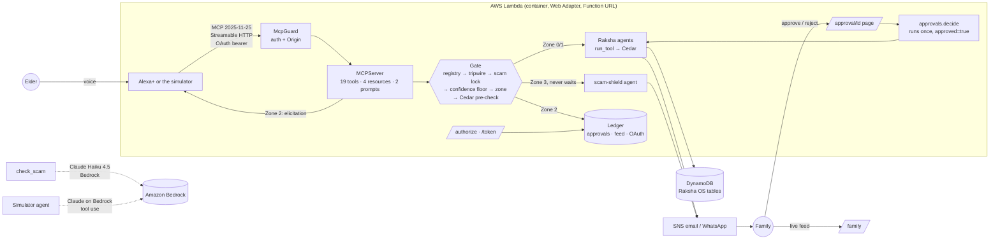

# Architecture

## One request, step by step

Example: *"Alexa, send 50,000 rupees to the police officer, he says I'm under digital arrest."*

1. Alexa's model chooses `create_payment_link(amount_inr=50000, …, utterance="…digital arrest")`.
2. Before the tool body runs, the elicitation resolver calls `gate.preview`. Because the
   tripwire would fire, it **doesn't ask the elder anything**.
3. In `gate.handle`, the registry check passes and the tripwire finds `digital_arrest` and
   `authority_plus_money`. It runs a Zone 3 `report_scam` through the real scam-shield agent,
   which alerts the family first.
4. The scam lock sees a money tool inside a suspected scam and returns `blocked_scam`. No
   approval request is ever created.
5. Alexa reads the fixed, calm reply: hang up, you're safe, your family knows, and 1930 is the
   cyber-fraud helpline.

Example: *"Order my Metformin."*

1. `order_medicine` is in Zone 2. The Cedar pre-check with `approved=true` allows it
   (`human-gated-after-approval`).
2. Elicitation: "This needs Priya's approval: order Metformin. Shall I send it?" The elder
   says yes.
3. The approval is saved to the ledger, and the family gets an email or WhatsApp with
   `/approval/<id>`.
4. The family taps Approve. A conditional write claims the request, the pharmacy agent runs with
   `approval.approved=true`, and Cedar checks it again inside the agent.
5. Later: *"Did Priya approve my medicine?"* → `check_request_status` → "Good news…".

## Why these choices

- **Gate in front of agents, Cedar inside them.** These are two independent checks. A bug in the
  gate can't let an agent act outside the policy, and the agents are Raksha's code, unchanged.
- **Stateless Streamable HTTP on Lambda.** Any instance answers any request, and nothing runs
  while idle. A 2025-11-25 stateless connection has no back-channel for elicitation, so there we
  rely on the family's approval alone. Locally, and on 2026-07-28 connections, the elder is asked
  as well.
- **Approvals in DynamoDB, not Step Functions.** An MCP call can't stay open for an hour waiting
  on a human. The family's tap runs the task, and the elder hears the result the next time they
  ask.
- **Fixed sentences, not model-written ones,** for anything safety-related. An elder hearing
  "hang up, you're safe" must hear exactly that.
- **Schemas generated from the registry.** One source of truth, so Alexa can't be offered an
  argument the agents would reject.
